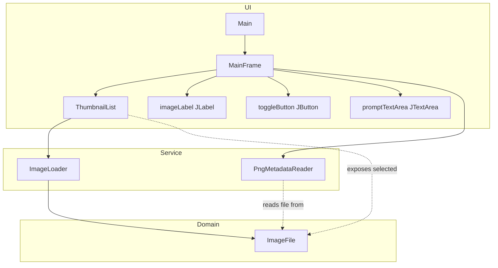
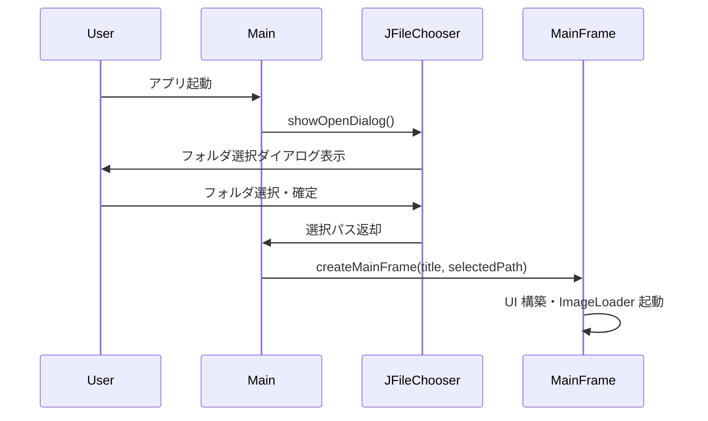
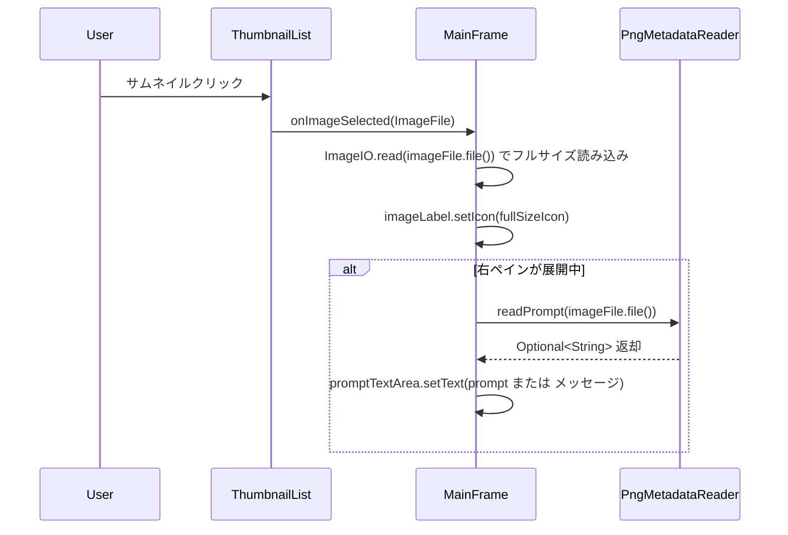
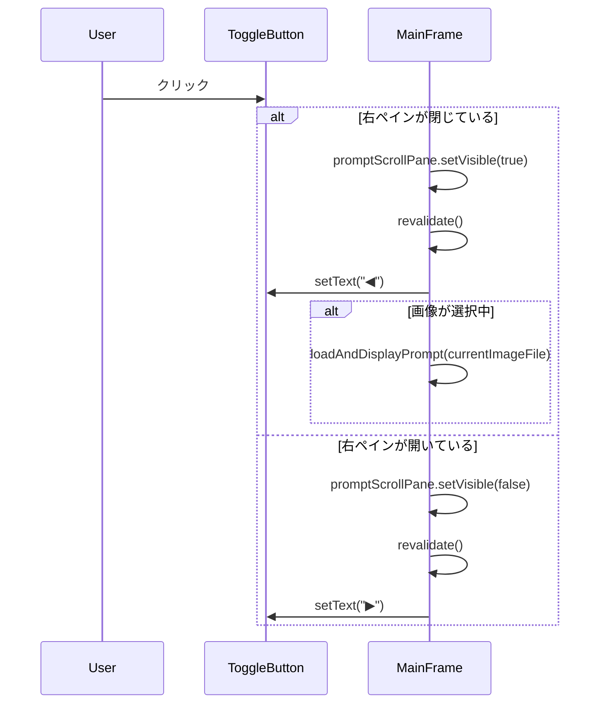

# Design Document: comfyui-image-viewer

## Overview

ComfyUI 生成画像ビューワーは、ComfyUI で生成した PNG 画像を閲覧・管理するための Java Swing デスクトップアプリケーション。起動時のフォルダ選択から、左ペインのサムネイル一覧、中央ペインのフルサイズ表示、右ペインの折りたたみ可能プロンプト表示までを単一ウィンドウで提供する。

**Purpose**: ComfyUI ユーザーが生成画像とプロンプトを同時に確認できる専用ビューワーを提供する。
**Users**: ComfyUI で画像を生成するユーザーが、生成物のレビューと評価のために使用する。
**Impact**: 既存の基本的なサムネイル表示実装を、フォルダ選択・フルサイズ表示・プロンプト確認を備えた完全なビューワーに拡張する。

### Goals
- 起動時フォルダ選択により任意のフォルダを対象にできる
- PNG サムネイル一覧から選択した画像をフルサイズで表示できる
- 右ペインでプロンプトメタデータを確認できる（折りたたみ可能）

### Non-Goals
- ズーム・回転などの画像操作
- `workflow` メタデータの表示
- PNG 以外の画像フォーマット対応
- ファイル操作（削除・移動・リネーム）

---

## Boundary Commitments

### This Spec Owns
- フォルダ選択ダイアログの起動フロー
- PNG サムネイルリスト（左ペイン）の表示と選択
- フルサイズ PNG 画像の表示（中央ペイン）
- PNG `prompt` メタデータの読み取りと右ペインへの表示
- 右ペインの折りたたみ/展開制御

### Out of Boundary
- ズーム・回転などの画像変換処理
- `workflow` メタデータの解析・表示
- PNG 以外のフォーマット対応
- ファイル操作（OS ファイルシステム操作）

### Allowed Dependencies
- Java 21 標準ライブラリ（`javax.swing`, `javax.imageio`, `java.io`, `java.util`）
- 既存クラス: `Main`, `MainFrame`, `ThumbnailList`, `ImageLoader`

### Revalidation Triggers
- `ImageFile` のフィールド変更（`file` / `thumbnail`）
- PNG メタデータキー名の変更（現在 `"prompt"`）
- アプリケーションのエントリポイント変更（`Main.java`）

---

## Architecture

### Existing Architecture Analysis

既存実装の構成:
- `Main.java` — エントリポイント。フォルダパスなし、`MainFrame.createMainFrame("Image Select Viewer")` を直接呼び出し
- `MainFrame.java` — `BorderLayout` で左ペイン（サムネイル）+ 中央ペイン（画像表示）を構成。フォルダパスはハードコード
- `ThumbnailList.java` — `DefaultListModel<ImageIcon>` + `JList<ImageIcon>` でサムネイル管理。ファイル参照を持たない
- `ImageLoader.java` — `SwingWorker<Void, ImageIcon>` で非同期サムネイル読み込み（100×100px）

変更が必要な問題点:
1. フォルダパスがハードコード → `JFileChooser` で起動時選択に変更
2. `ThumbnailList` が `ImageIcon` のみ保持（ファイル参照なし）→ `ImageFile` モデルに変更
3. 中央ペインがサムネイルアイコンをそのまま表示 → フルサイズ読み込みに変更
4. 右ペインなし → 新規追加

### Architecture Pattern & Boundary Map

レイヤー構成: **Domain Model → Service → UI**（依存方向は左から右。逆方向禁止）



### Technology Stack

| Layer | Choice / Version | Role | Notes |
|-------|-----------------|------|-------|
| UI | Java Swing (JDK 21) | ウィンドウ・パネル・リスト・テキスト表示 | 既存スタック継続 |
| Image I/O | `javax.imageio.ImageIO` (JDK 21) | PNG 読み込み・メタデータ解析 | 追加ライブラリ不要 |
| Async | `javax.swing.SwingWorker` (JDK 21) | バックグラウンド画像読み込み | 既存パターン継続 |

---

## File Structure Plan

### Directory Structure

```
src/main/java/com/github/us_aito/image_select_viewer/
├── Main.java                  # エントリポイント（フォルダ選択ダイアログ追加）
├── MainFrame.java             # メインウィンドウ（右ペイン・トグルボタン追加）
├── ImageFile.java             # [新規] ファイル参照 + サムネイルを保持するドメインモデル
├── ThumbnailList.java         # サムネイルリスト（ImageFile モデルに変更）
├── ImageLoader.java           # 非同期読み込み（ImageFile を publish するよう変更）
└── PngMetadataReader.java     # [新規] PNG tEXt チャンク読み取りユーティリティ
```

### Modified Files
- `Main.java` — `JFileChooser` でフォルダ選択し、パスを `MainFrame.createMainFrame` に渡す
- `MainFrame.java` — 右ペイン（`JScrollPane` + `JTextArea`）とトグルボタンを追加、フルサイズ画像表示を実装、`createMainFrame` の引数に `imagePath` を追加
- `ThumbnailList.java` — モデルを `DefaultListModel<ImageFile>` に変更、セルレンダラー追加、選択値を `ImageFile` で返す
- `ImageLoader.java` — `SwingWorker<Void, ImageFile>` に変更、`ImageFile` を `publish` するよう変更

---

## System Flows

### 起動フロー



### 画像選択フロー



### 右ペイン切り替えフロー



---

## Requirements Traceability

| 要件 | 概要 | コンポーネント | インターフェース |
|------|------|--------------|----------------|
| 1.1 | 起動時ダイアログ表示 | `Main` | `main(String[])` |
| 1.2 | フォルダ確定後 PNG 読み込み | `Main`, `ThumbnailList`, `ImageLoader` | `createMainFrame(String, String)` |
| 1.3 | キャンセル時終了 | `Main` | `main(String[])` |
| 1.4 | ディレクトリのみ選択可 | `Main` (JFileChooser) | `setFileSelectionMode(DIRECTORIES_ONLY)` |
| 2.1 | PNG のみ左ペインに表示 | `ImageLoader` | `doInBackground()` |
| 2.2 | バックグラウンド非同期読み込み | `ImageLoader` (SwingWorker) | `publish(ImageFile)`, `process(List<ImageFile>)` |
| 2.3 | PNG 以外を除外 | `ImageLoader` | `doInBackground()` |
| 2.4 | サムネイル選択で中央ペイン更新 | `ThumbnailList`, `MainFrame` | `addThumbnailSelectionListener` |
| 3.1 | フルサイズ表示 | `MainFrame` | `onImageSelected(ImageFile)` |
| 3.2 | スクロールバー表示 | `MainFrame` (JScrollPane) | — |
| 3.3 | 起動直後空白 | `MainFrame` | UI 初期化 |
| 4.1 | トグルボタン常時表示 | `MainFrame` | UI 構築 |
| 4.2 | 右ペイン展開 | `MainFrame` | `togglePromptPane()` |
| 4.3 | 右ペイン折りたたみ | `MainFrame` | `togglePromptPane()` |
| 4.4 | 起動時折りたたみ状態 | `MainFrame` | UI 初期化 |
| 5.1 | prompt メタデータ表示 | `PngMetadataReader`, `MainFrame` | `readPrompt(File)` |
| 5.2 | メタデータなし時メッセージ | `PngMetadataReader`, `MainFrame` | `readPrompt(File)` |
| 5.3 | 折りたたみ中は非表示維持 | `MainFrame` | `onImageSelected(ImageFile)` |
| 5.4 | スクロール可能テキスト表示 | `MainFrame` (JScrollPane + JTextArea) | — |

---

## Components and Interfaces

### コンポーネントサマリー

| コンポーネント | レイヤー | 責務 | 要件 | 主要依存 |
|---|---|---|---|---|
| `ImageFile` | Domain | ファイル参照とサムネイルを保持するイミュータブルモデル | 2.1, 2.4, 3.1, 5.1 | なし |
| `ImageLoader` | Service | バックグラウンドで PNG を読み込み ImageFile を生成 | 2.1, 2.2, 2.3 | `ImageFile` |
| `PngMetadataReader` | Service | PNG tEXt チャンクから prompt を抽出 | 5.1, 5.2 | Java ImageIO |
| `ThumbnailList` | UI | サムネイルリストの表示と選択イベント通知 | 2.1, 2.2, 2.4 | `ImageLoader`, `ImageFile` |
| `MainFrame` | UI | メインウィンドウ全体の組み立てと状態管理 | 1.2, 3.1–3.3, 4.1–4.4, 5.1–5.4 | 全コンポーネント |
| `Main` | UI | 起動エントリポイント・フォルダ選択ダイアログ | 1.1, 1.3, 1.4 | `MainFrame` |

---

### Domain

#### ImageFile

| Field | Detail |
|-------|--------|
| Intent | PNG ファイルへの参照とサムネイル ImageIcon を保持するイミュータブルモデル |
| Requirements | 2.1, 2.4, 3.1, 5.1 |

**Responsibilities & Constraints**
- `file`: `java.io.File` — PNG ファイルへの参照（フルサイズ読み込み・メタデータ読み取りに使用）
- `thumbnail`: `ImageIcon` — リスト表示用サムネイル（100×100px）
- Java record として実装（イミュータブル）

**Contracts**: State [x]

```java
public record ImageFile(File file, ImageIcon thumbnail) {}
```

---

### Service

#### ImageLoader

| Field | Detail |
|-------|--------|
| Intent | PNG ファイルを非同期でスキャンし、サムネイル付き ImageFile を生成してモデルに追加する |
| Requirements | 2.1, 2.2, 2.3 |

**Responsibilities & Constraints**
- `SwingWorker<Void, ImageFile>` として動作
- フォルダ内ファイルを走査し、`ImageIO.read` が null を返さないファイル（実質 PNG）のみ処理
- サムネイルは 100×100px にスケール
- `process()` で EDT 上の `DefaultListModel<ImageFile>` に追加

**Contracts**: Service [x]

```java
public class ImageLoader extends SwingWorker<Void, ImageFile> {
    public ImageLoader(String imagePath, DefaultListModel<ImageFile> model);
    @Override protected Void doInBackground();
    @Override protected void process(List<ImageFile> chunks);
}
```

**Implementation Notes**
- 型変更のみ（ロジック変更なし）: `ImageIcon` → `ImageFile`
- `doInBackground()` 内: `new ImageFile(imageFileList[i], new ImageIcon(scaledImage))` で生成

#### PngMetadataReader

| Field | Detail |
|-------|--------|
| Intent | PNG ファイルの tEXt メタデータチャンクから `prompt` キーの値を抽出するユーティリティ |
| Requirements | 5.1, 5.2 |

**Responsibilities & Constraints**
- ステートレスなユーティリティクラス（静的メソッドのみ）
- Java 標準の `ImageIO` + `IIOMetadata` を使用
- `prompt` キーが存在しない場合は `Optional.empty()` を返す（例外をスローしない）
- I/O エラーは `IOException` としてスロー

**Contracts**: Service [x]

```java
public class PngMetadataReader {
    /**
     * PNG ファイルの tEXt チャンクから "prompt" キーの値を返す。
     * @param file 対象 PNG ファイル
     * @return prompt の値。存在しない場合は Optional.empty()
     * @throws IOException ファイル読み取り失敗時
     */
    public static Optional<String> readPrompt(File file) throws IOException;
}
```

- Preconditions: `file` は存在する PNG ファイル
- Postconditions: `prompt` tEXt チャンクが存在すれば非 empty の `Optional` を返す

**Implementation Notes**
- `ImageIO.createImageInputStream(file)` + `ImageIO.getImageReadersByFormatName("png")`
- `reader.getImageMetadata(0).getAsTree("javax_imageio_png_1.0")` で DOM 取得
- `tEXtEntry` ノードを走査し、`keyword` 属性が `"prompt"` のものの `value` 属性を返す
- リソースリーク防止: `ImageInputStream` と `ImageReader` を try-finally で close

---

### UI

#### ThumbnailList（変更）

| Field | Detail |
|-------|--------|
| Intent | PNG サムネイルを一覧表示し、選択イベントを MainFrame に通知する |
| Requirements | 2.1, 2.2, 2.4 |

**変更箇所:**
- `DefaultListModel<ImageIcon>` → `DefaultListModel<ImageFile>`
- `JList<ImageIcon>` → `JList<ImageFile>`
- セルレンダラー追加（`imageFile.thumbnail()` を `JLabel` に設定する匿名クラス）
- `getSelectedIcon()` → `getSelectedImageFile(): ImageFile`

```java
public class ThumbnailList {
    public ThumbnailList(String imagePath);
    public JScrollPane getThumbnailPane();
    public ImageFile getSelectedImageFile();
    public void addThumbnailSelectionListener(ListSelectionListener listener);
}
```

#### MainFrame（変更）

| Field | Detail |
|-------|--------|
| Intent | メインウィンドウを組み立て、コンポーネント間のインタラクションを調整する |
| Requirements | 1.2, 3.1, 3.2, 3.3, 4.1, 4.2, 4.3, 4.4, 5.1, 5.2, 5.3, 5.4 |

**レイアウト構成:**

```
mainPanel (BorderLayout)
├── LINE_START: thumbnailList.getThumbnailPane() [幅 200px]
├── CENTER: centerWrapper (BorderLayout)
│   ├── CENTER: imageScrollPane (JScrollPane wrapping imageLabel)
│   └── LINE_END: togglePanel (幅 20px、JButton ▶/◀)
└── LINE_END: promptScrollPane (JScrollPane wrapping promptTextArea、初期 visible=false)
```

**右ペイン開閉ロジック:**
- `promptScrollPane.setVisible(true/false)` + `mainPanel.revalidate()` で表示切り替え
- BorderLayout は `isVisible() == false` のコンポーネントをレイアウトから除外するため、表示領域が正しく解放される

**インターフェース変更:**

```java
public class MainFrame {
    // imagePath 引数を追加
    public static JFrame createMainFrame(String title, String imagePath);
}
```

**Implementation Notes**
- フルサイズ読み込み: `ImageIO.read(imageFile.file())` → `new ImageIcon(bufferedImage)` → `imageLabel.setIcon(icon)`
- 起動状態: `promptScrollPane.setVisible(false)`、ボタンラベル `"▶"`
- 右ペイン展開時に画像が選択されていれば `PngMetadataReader.readPrompt()` を呼び出してテキストを更新
- メタデータ読み取りの `IOException` は catch してプロンプトエリアにエラーメッセージを表示

#### Main（変更）

| Field | Detail |
|-------|--------|
| Intent | アプリ起動時にフォルダ選択ダイアログを表示し、選択パスを MainFrame に渡す |
| Requirements | 1.1, 1.3, 1.4 |

```java
public class Main {
    public static void main(String[] args) {
        SwingUtilities.invokeLater(() -> {
            JFileChooser chooser = new JFileChooser();
            chooser.setFileSelectionMode(JFileChooser.DIRECTORIES_ONLY);
            int result = chooser.showOpenDialog(null);
            if (result == JFileChooser.APPROVE_OPTION) {
                String path = chooser.getSelectedFile().getAbsolutePath();
                JFrame frame = MainFrame.createMainFrame("ComfyUI Image Viewer", path);
                frame.setVisible(true);
            } else {
                System.exit(0);
            }
        });
    }
}
```

---

## Error Handling

### Error Strategy

| エラーケース | 対応方針 | 要件 |
|---|---|---|
| フォルダ選択キャンセル | `System.exit(0)` でアプリ終了 | 1.3 |
| PNG 以外のファイル | `ImageIO.read` が null → スキップ（リストに非追加） | 2.3 |
| PNG メタデータなし | `Optional.empty()` → 右ペインに「プロンプト情報がありません」表示 | 5.2 |
| PNG メタデータ読み取り IOException | catch → 右ペインにエラーメッセージ表示 | 5.2 |
| フルサイズ画像読み込みエラー | catch → 中央ペインを空白のまま維持、stderr にログ出力 | — |

---

## Testing Strategy

### ユニットテスト
1. `PngMetadataReader.readPrompt()` — `prompt` tEXt チャンクを持つ PNG でその値が返ること
2. `PngMetadataReader.readPrompt()` — `prompt` チャンクを持たない PNG で `Optional.empty()` が返ること
3. `ImageLoader` — PNG 以外のファイルが `DefaultListModel<ImageFile>` に追加されないこと

### 統合テスト
1. サムネイル選択 → 中央ペインにフルサイズ画像が表示されること
2. サムネイル選択 + 右ペイン展開 → プロンプトテキストが表示されること
3. `prompt` メタデータなし画像を選択 → 右ペインに「プロンプト情報がありません」が表示されること

### UI 動作確認
1. 起動時にフォルダ選択ダイアログが表示されること
2. キャンセル時にアプリが終了すること
3. トグルボタンで右ペインが開閉し、ボタンラベルが `▶` / `◀` に切り替わること
