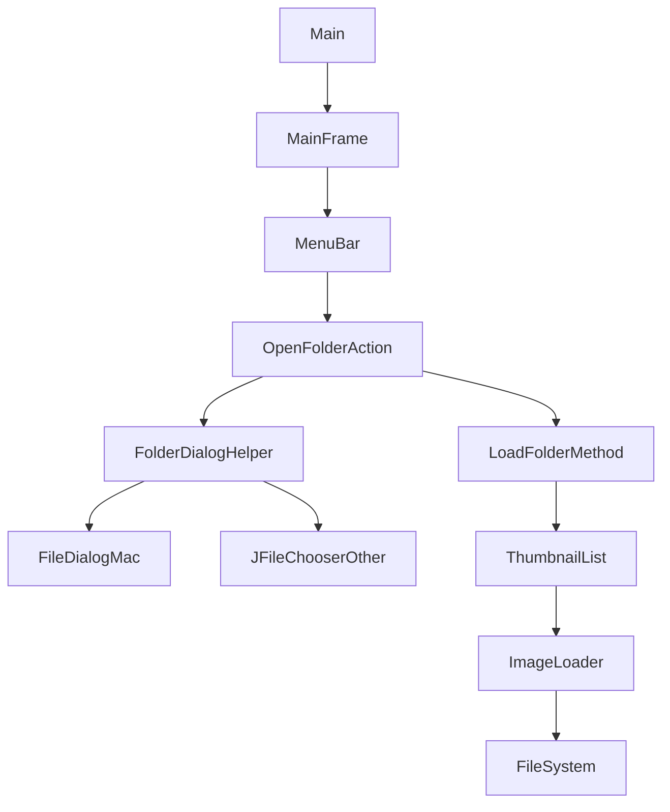
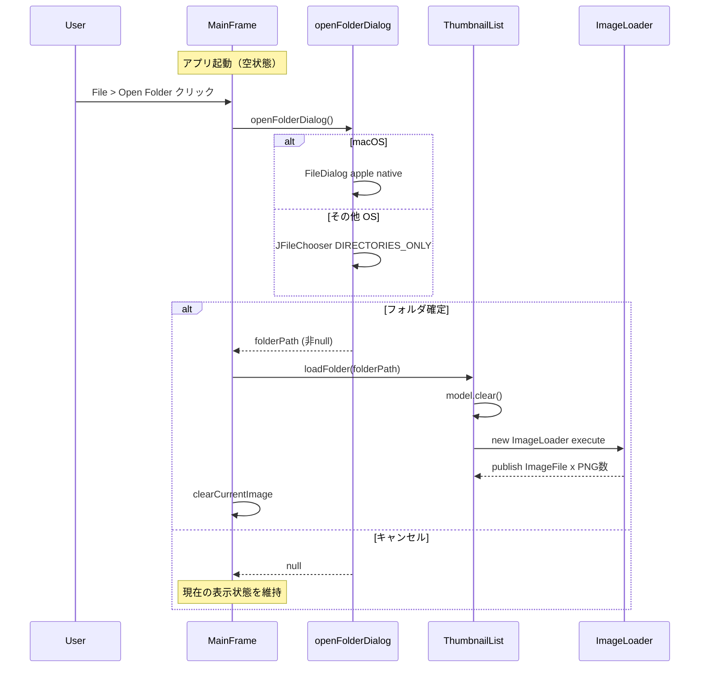

# Design Document

## Overview

本フィーチャーは、ComfyUI Image Viewer の起動UXとフォルダ選択フローを刷新する。現行実装では起動時に必ずフォルダ選択ダイアログが表示されアプリを強制的に操作させるが、本変更後はアプリが空状態で起動し、ユーザーが任意のタイミングでメニューバーの `File > Open Folder` からフォルダを選択できるようになる。

対象ユーザーは ComfyUI で生成した PNG 画像を確認したい利用者。既存の `MainFrame`・`ThumbnailList`・`Main` クラスへの最小限の変更で実現し、画像表示・右ペイン・メタデータ表示など他の機能は無変更で維持する。

### Goals
- 起動時フォルダ選択ダイアログの廃止と空状態表示の実現
- OS標準フォルダ選択ダイアログを持つ `File > Open Folder` メニューの追加
- フォルダの繰り返し切り替えのサポート（既存サムネイルのクリアと再読み込み）

### Non-Goals
- ズーム・回転などの画像操作（`image-zoom-control` スペックが担当）
- フォルダ履歴やお気に入りフォルダの保持
- キーボードショートカット（Cmd+O / Ctrl+O）によるフォルダ選択

## Boundary Commitments

### This Spec Owns
- アプリ起動フロー（空状態表示への変更）
- `JMenuBar` の生成と `File > Open Folder` アクション
- OS判定によるネイティブフォルダ選択ダイアログの表示
- フォルダ選択後のサムネイルリスト読み込みトリガー
- フォルダ切り替え時の現在画像クリア

### Out of Boundary
- サムネイル描画・スクロール（`ThumbnailList` / `ImageLoader` の既存ロジック）
- フルサイズ画像描画（`MainFrame` の既存 `updateImageDisplay()` ロジック）
- 右ペイン折りたたみ・プロンプトメタデータ表示
- ズームコントロール（`image-zoom-control` スペック担当）

### Allowed Dependencies
- Java AWT: `java.awt.FileDialog`（macOS ネイティブダイアログ）
- Java Swing: `JFileChooser`（非macOS フォルダ選択）
- 既存クラス: `ThumbnailList`、`ImageLoader`、`MainFrame`

### Revalidation Triggers
- `ThumbnailList` の公開インターフェース変更（特に `loadFolder()` シグネチャ変更）
- `MainFrame.createMainFrame()` の引数変更
- `image-zoom-control` スペックが中央ペインのレイアウトを変更する場合、本スペックの clearCurrentImage 処理との競合を確認すること

## Architecture

### Existing Architecture Analysis

現行フロー（変更前）:
1. `Main.main()` が `JFileChooser` を表示
2. フォルダ確定 → `MainFrame.createMainFrame(title, path)` を呼び出し
3. キャンセル → `System.exit(0)`

変更後フロー:
1. `Main.main()` が直接 `MainFrame.createMainFrame(title)` を呼び出し（パスなし）
2. `MainFrame` は空状態で表示（`ThumbnailList` は空、中央ペインは空白）
3. ユーザーが `File > Open Folder` を選択 → `openFolderDialog()` が OS 標準ダイアログを表示
4. 確定 → `loadImagesFromFolder(path)` を呼び出し
5. キャンセル → 現在の状態を維持

### Architecture Pattern & Boundary Map



- `OpenFolderAction`: `File > Open Folder` の ActionListener（MainFrame のインナーロジック）
- `FolderDialogHelper`: private メソッド `openFolderDialog()` — OS判定とダイアログ表示
- `LoadFolderMethod`: private メソッド `loadImagesFromFolder(String path)` — ThumbnailList のリフレッシュと画像クリア

### Technology Stack

| Layer | Choice | Role | Notes |
|-------|--------|------|-------|
| UI Framework | Java Swing (JMenuBar) | メニューバー追加 | 既存スタックと同一 |
| OS Dialog (macOS) | java.awt.FileDialog | ネイティブ Finder ダイアログ | `apple.awt.fileDialogForDirectories=true` 設定が必要 |
| OS Dialog (他OS) | JFileChooser (DIRECTORIES_ONLY) | OS標準に近いフォルダ選択 | 既存スタックと同一 |

## File Structure Plan

### Directory Structure
```
src/main/java/com/github/us_aito/image_select_viewer/
├── Main.java          — 変更: JFileChooser の削除、空状態でのMainFrame起動
├── MainFrame.java     — 変更: JMenuBar追加、openFolderDialog()、loadImagesFromFolder()
└── ThumbnailList.java — 変更: loadFolder(String) メソッドの追加、初期 null パス対応
```

### Modified Files
- `src/main/java/com/github/us_aito/image_select_viewer/Main.java` — `JFileChooser` の起動ロジックを削除し、`createMainFrame` をパスなしで呼び出す
- `src/main/java/com/github/us_aito/image_select_viewer/MainFrame.java` — `JMenuBar` 生成、`openFolderDialog()` private メソッド、`loadImagesFromFolder(String)` メソッドを追加
- `src/main/java/com/github/us_aito/image_select_viewer/ThumbnailList.java` — `loadFolder(String path)` メソッドを追加、コンストラクタが null パスを受け入れるよう変更

## System Flows



## Requirements Traceability

| Requirement | Summary | Components | 実現方法 |
|---|---|---|---|
| 1.1 | 起動時ダイアログなし | Main.java | JFileChooser を削除し空状態で MainFrame を起動 |
| 1.2 | 起動時サムネイル空 | ThumbnailList | null パスを受け取り ImageLoader を起動しない |
| 1.3 | 起動時中央ペイン空白 | MainFrame | 既存の空表示ロジックを維持（画像未選択時） |
| 2.1 | File > Open Folder メニュー | MainFrame (JMenuBar) | JMenuBar + JMenu File + JMenuItem Open Folder |
| 2.2 | OS標準ダイアログ | openFolderDialog() | macOS: FileDialog / 他OS: JFileChooser |
| 2.3 | ディレクトリのみ選択 | openFolderDialog() | FileDialog の System property / JFileChooser.DIRECTORIES_ONLY |
| 2.4 | PNG読み込み | loadImagesFromFolder() | ThumbnailList.loadFolder() 経由で既存 ImageLoader を再利用 |
| 2.5 | キャンセル時状態維持 | openFolderDialog() | null 返却時は loadImagesFromFolder() を呼ばない |
| 2.6 | フォルダ切り替え時クリア | ThumbnailList.loadFolder() | model.clear() 後に新 ImageLoader 実行 |
| 3.1〜3.4 | サムネイルリスト | ThumbnailList / ImageLoader | 既存ロジック変更なし |
| 4.1〜4.3 | フルサイズ画像表示 | MainFrame | 既存ロジック変更なし |
| 5.1〜5.4 | 右ペイン折りたたみ | MainFrame | 既存ロジック変更なし |
| 6.1〜6.4 | PNGメタデータ表示 | MainFrame / PngMetadataReader | 既存ロジック変更なし |

## Components and Interfaces

### コンポーネントサマリー

| Component | Layer | Intent | Req Coverage | 変更種別 |
|---|---|---|---|---|
| Main | エントリーポイント | アプリ起動フロー制御 | 1.1 | 変更 |
| MainFrame | UIフレーム | メニューバー・フォルダ選択・読み込みトリガー | 1.2, 1.3, 2.1〜2.6 | 変更 |
| ThumbnailList | UIコンポーネント | サムネイル表示・動的フォルダ読み込み対応 | 1.2, 2.4, 2.6 | 変更 |

### エントリーポイント層

#### Main

| Field | Detail |
|-------|--------|
| Intent | JFileChooser を削除し、空状態で MainFrame を起動する |
| Requirements | 1.1 |

**変更内容**
- `JFileChooser` の生成・表示・パス取得を削除
- `MainFrame.createMainFrame(title)` を直接呼び出す（パス引数なし）
- `System.exit(0)` のキャンセル処理を削除

**Contracts**: Service [x]

##### Service Interface
```java
// 変更前
public static void main(String[] args) {
    // JFileChooser でフォルダ選択後に MainFrame を起動
}

// 変更後
public static void main(String[] args) {
    SwingUtilities.invokeLater(() -> MainFrame.createMainFrame(title));
}
```

---

### UIフレーム層

#### MainFrame

| Field | Detail |
|-------|--------|
| Intent | JMenuBar 追加、OS 標準ダイアログによるフォルダ選択、サムネイルリフレッシュのトリガー |
| Requirements | 1.2, 1.3, 2.1, 2.2, 2.3, 2.4, 2.5, 2.6 |

**Responsibilities & Constraints**
- `JMenuBar` に `File > Open Folder` メニューを追加する
- `openFolderDialog()` は OS を検出して適切なダイアログを表示し、選択パスまたは null を返す
- `loadImagesFromFolder(String path)` は `ThumbnailList.loadFolder()` を呼び出し、現在画像をクリアする
- EDT 上で実行されることを前提とする（SwingWorker はすでに ThumbnailList/ImageLoader が担当）

**Dependencies**
- Outbound: `ThumbnailList.loadFolder(String)` — フォルダ変更通知 (P0)
- External: `java.awt.FileDialog` — macOS ネイティブダイアログ (P1)
- External: `JFileChooser` — 非macOS フォルダ選択 (P1)

**Contracts**: Service [x]

##### Service Interface

```java
// 既存シグネチャ変更 (imagePath 引数を削除)
public static JFrame createMainFrame(String title);

// 新規追加: private メソッド
// macOS: System.setProperty("apple.awt.fileDialogForDirectories", "true") + FileDialog
// 他OS: new JFileChooser(); chooser.setFileSelectionMode(JFileChooser.DIRECTORIES_ONLY)
// 選択確定: 選択パス文字列を返す / キャンセル: null を返す
private String openFolderDialog(JFrame parentFrame);

// 新規追加: private メソッド
// thumbnailList.loadFolder(folderPath) を呼び出す
// imageLabel.setIcon(null) で現在画像をクリアする
private void loadImagesFromFolder(String folderPath);
```

**Implementation Notes**
- OS 判定は `System.getProperty("os.name").toLowerCase().contains("mac")` で行う
- `openFolderDialog()` が null を返した場合は `loadImagesFromFolder()` を呼ばない
- 旧 `SwingWorker` が完了前に新しい読み込みが始まっても `model.clear()` 後は旧エントリーが UI に残らないため許容範囲内

---

#### ThumbnailList

| Field | Detail |
|-------|--------|
| Intent | 動的フォルダ切り替えに対応するため `loadFolder(String)` メソッドを追加する |
| Requirements | 1.2, 2.4, 2.6 |

**変更内容**
- コンストラクタが `imagePath == null` の場合は `ImageLoader` を起動しない
- `loadFolder(String path)` メソッドを追加: `model.clear()` 後に新しい `ImageLoader(model, path).execute()` を実行する

**Contracts**: Service [x]

##### Service Interface
```java
// 変更: コンストラクタで null を許容（ImageLoader を起動しない）
public ThumbnailList(String imagePath);

// 新規追加
// model.clear() を呼び出す
// new ImageLoader(model, folderPath).execute() を呼び出す
public void loadFolder(String folderPath);
```

- Preconditions: `folderPath` は非 null かつ有効なディレクトリパス（MainFrame 側で確認済み）
- Postconditions: `model` がクリアされ、新 `ImageLoader` が非同期で PNG を追加し始める

## Error Handling

### Error Strategy

| エラーケース | 発生箇所 | 対処方法 |
|---|---|---|
| ダイアログキャンセル | `openFolderDialog()` | null を返す。呼び出し元でガード |
| 無効なフォルダパス | `ImageLoader.doInBackground()` | 既存の null チェックで空リストを返す |
| ファイルアクセス権限エラー | `ImageLoader` | 既存の例外ハンドリングで該当ファイルをスキップ |

ユーザー向けエラーダイアログは現行の方針（エラー時はそのファイルをスキップ）を維持する。

## Testing Strategy

### 手動統合テスト
- 起動時にフォルダ選択ダイアログが表示されないことを確認（1.1）
- `File > Open Folder` でフォルダを選択後、サムネイルが表示されること（2.4）
- ダイアログキャンセル時に現在の表示状態が維持されること（2.5）
- 別フォルダを選択した際にサムネイルがクリアされ再読み込みされること（2.6）
- macOS でネイティブ Finder ダイアログが表示されること（2.2）
- 起動直後は中央ペインが空白であること（1.3）
