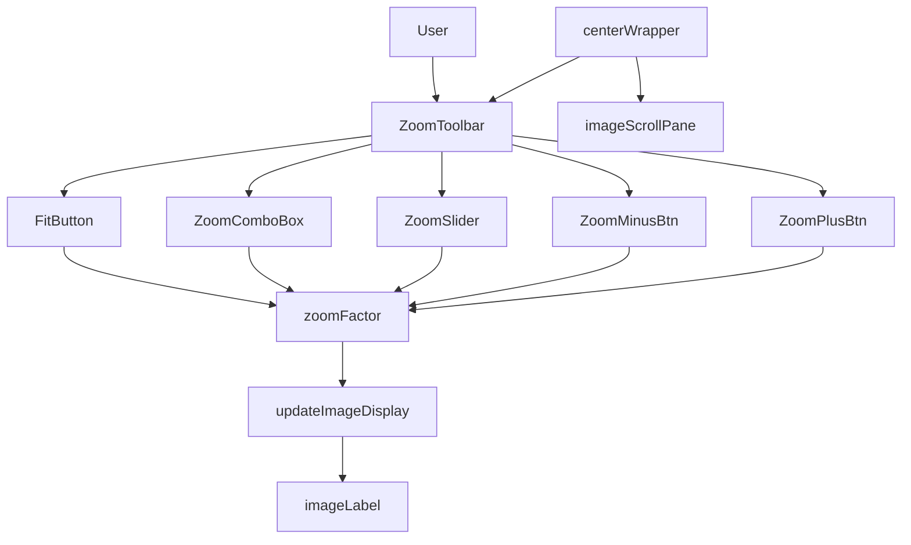
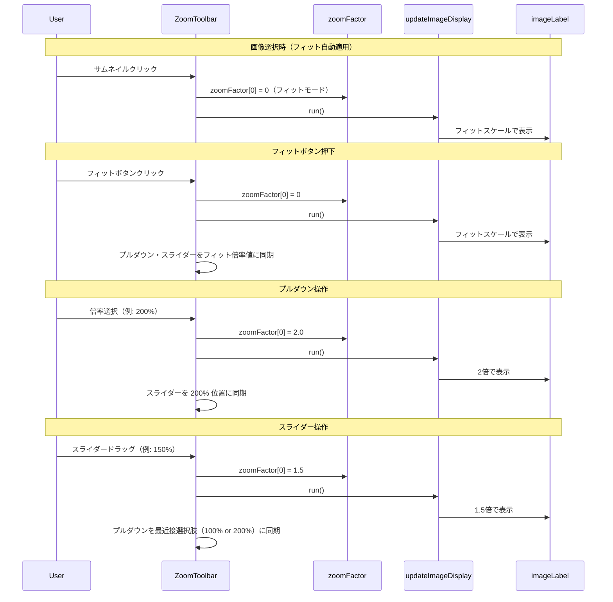

# Design Document

## Overview

本フィーチャーは、ComfyUI Image Viewer の中央ペイン下部にズームコントロールツールバーを追加する。現在の `updateImageDisplay()` はウィンドウサイズへのフィットスケールのみを提供しているが、本変更後はユーザーがフィットボタン・倍率プルダウン・スライダーの3つのコントロールで任意の倍率を設定できるようになる。

ズーム倍率の状態は `MainFrame` 内の `zoomFactor` フィールドで保持し、`updateImageDisplay()` を拡張してフィット計算と固定倍率表示の両モードに対応させる。ツールバーは標準 Swing コンポーネントのみで実装し、追加ライブラリは使用しない。

### Goals
- フィットボタン・倍率プルダウン・スライダーによる3種のズーム操作
- 3コントロール間の相互同期（いずれを操作しても他が追従）
- 画像新規選択時の自動フィット適用

### Non-Goals
- マウスホイールによるズーム
- キーボードショートカット
- ズーム状態の永続化（再起動時にリセット）
- 画像の回転・反転

## Boundary Commitments

### This Spec Owns
- `centerWrapper` の SOUTH 領域への `ZoomToolbar` パネル追加
- `zoomFactor` フィールドの導入と管理
- `updateImageDisplay()` のズーム倍率対応への拡張
- ツールバー3コントロールの相互同期ロジック
- 画像選択時のフィット自動適用

### Out of Boundary
- フォルダ選択・メニューバー（`comfyui-image-viewer` スペック担当）
- 右ペイン・プロンプト表示（既存ロジック変更なし）
- サムネイルリスト（既存ロジック変更なし）
- `ThumbnailList`・`ImageLoader`・`PngMetadataReader` の変更

### Allowed Dependencies
- Java Swing: `JSlider`, `JComboBox`, `JButton`, `JLabel`（標準コンポーネント）
- 既存: `MainFrame`、`currentImage[]`、`imageScrollPane`、`imageLabel`

### Revalidation Triggers
- `updateImageDisplay()` のシグネチャ変更
- `centerWrapper` のレイアウト変更（`image-zoom-control` 完了後に `comfyui-image-viewer` の右ペイントグルが影響を受ける可能性）
- ズーム倍率の選択肢（プルダウンの値配列）の変更

## Architecture

### Existing Architecture Analysis

現行の画像表示フロー:
1. サムネイル選択 → `ImageIO.read()` で `BufferedImage` を `currentImage[0]` に格納
2. `updateImageDisplay.run()` を呼び出し → ビューポートサイズにフィットするスケールを計算
3. `img.getScaledInstance()` でスケーリング → `imageLabel.setIcon()` で表示
4. ウィンドウリサイズ時も `ComponentAdapter` が `updateImageDisplay.run()` を再実行

変更後フロー:
1. 上記と同様
2. `updateImageDisplay.run()` が `zoomFactor[0]` を参照
   - `zoomFactor[0] == 0` の場合: フィットスケールを計算（既存挙動と同一）
   - `zoomFactor[0] > 0` の場合: `zoomFactor[0]` を固定倍率として使用
3. ツールバーコントロール操作時: `zoomFactor[0]` を更新後 `updateImageDisplay.run()` を呼び出す

### Architecture Pattern & Boundary Map



- `ZoomToolbar`: `centerWrapper` の SOUTH に配置する `JPanel`。5つのコントロールを水平配置し、`zoomFactor` の読み書きと `updateImageDisplay` の呼び出しを担う
- `zoomFactor`: `double[] zoomFactor = {0}` — 0 はフィットモード、正値は固定倍率（例: 1.0 = 100%）
- `updateImageDisplay`: ズーム倍率対応に拡張した Runnable

### Technology Stack

| Layer | Choice | Role | Notes |
|-------|--------|------|-------|
| UI Components | JPanel, JButton, JComboBox, JSlider | ズームツールバー実装 | 既存スタックと同一、追加ライブラリなし |
| Image Scaling | BufferedImage.getScaledInstance / Image.SCALE_SMOOTH | ズーム倍率でのスケーリング | 既存パターンを維持 |

## File Structure Plan

### Directory Structure
```
src/main/java/com/github/us_aito/image_select_viewer/
└── MainFrame.java  — 変更: zoomFactor フィールド追加、updateImageDisplay 拡張、
                       ZoomToolbar パネルと5コントロール追加、
                       3コントロール相互同期ロジック、画像選択時フィット自動適用
```

### Modified Files
- `src/main/java/com/github/us_aito/image_select_viewer/MainFrame.java`
  - `double[] zoomFactor = {0}` フィールド追加
  - `updateImageDisplay` の倍率ロジック拡張（zoomFactor 参照）
  - `centerWrapper` の SOUTH に `ZoomToolbar` パネル追加
  - フィットボタン / `JComboBox` / `JSlider` / ⊖ / ⊕ ボタンの生成とリスナー登録
  - サムネイル選択リスナー内での `zoomFactor[0] = 0` リセット（フィット自動適用）

## System Flows



## Requirements Traceability

| Requirement | Summary | 実現方法 |
|---|---|---|
| 1.1 | ツールバー常時表示 | centerWrapper SOUTH に ZoomToolbar を追加 |
| 1.2 | フィット/プルダウン/スライダーを含む | 3コントロール + ⊖/⊕ を ZoomToolbar に実装 |
| 1.3 | 画像未選択時もツールバー表示 | ZoomToolbar は centerWrapper に常に追加済み |
| 2.1 | フィットボタンでフィット表示 | zoomFactor[0]=0 に設定 → updateImageDisplay がフィット計算 |
| 2.2 | フィット時にプルダウン/スライダーを同期 | フィットボタン押下後に計算されたフィット倍率をコントロールに反映 |
| 2.3 | 画像選択時にフィット自動適用 | サムネイル選択リスナー内で zoomFactor[0]=0 にリセット |
| 3.1 | プルダウンに12段階の選択肢 | ZOOM_LEVELS 定数配列 {10,25,50,75,100,200,300,400,500,600,700,800} |
| 3.2 | プルダウン選択で倍率変更 | 選択値 / 100.0 を zoomFactor に設定 → updateImageDisplay |
| 3.3 | プルダウン選択でスライダー同期 | スライダー値を選択された % 値に設定 |
| 3.4 | 現在の倍率をプルダウンに表示 | スライダー/⊖/⊕ 操作後にプルダウンの選択を最近接値に更新 |
| 4.1 | スライダー範囲 10%〜800% | JSlider の min=10, max=800 |
| 4.2 | スライダー操作でリアルタイム反映 | ChangeListener で updateImageDisplay を呼び出し |
| 4.3 | スライダー操作でプルダウン同期 | 最近接の ZOOM_LEVELS 値を選択 |
| 4.4 | ⊖/⊕ ボタン表示 | JButton を JSlider の両端に配置 |
| 4.5 | ⊖ で一段階縮小 | 現在の ZOOM_LEVELS インデックスを -1 してプルダウン選択と同じ処理 |
| 4.6 | ⊕ で一段階拡大 | 現在の ZOOM_LEVELS インデックスを +1 してプルダウン選択と同じ処理 |
| 5.1 | 拡大時スクロールバー表示 | imageScrollPane は JScrollPane.SCROLLBARS_AS_NEEDED（デフォルト）を維持 |
| 5.2 | 縮小時スクロールバー非表示 | 同上（コンテンツがビューポートより小さければ自動的に非表示） |

## Components and Interfaces

### コンポーネントサマリー

| Component | Layer | Intent | Req Coverage | 変更種別 |
|---|---|---|---|---|
| ZoomToolbar パネル | UIパネル | ツールバーコンテナ（5コントロールを水平配置） | 1.1, 1.2, 1.3 | 新規追加 |
| zoomFactor フィールド | 状態 | 現在のズーム倍率を保持（0=フィット、正値=固定倍率） | 2.1〜4.6 | 新規追加 |
| updateImageDisplay | ロジック | zoomFactor を参照して画像をスケーリング | 2.1, 3.2, 4.2 | 変更 |
| ZOOM_LEVELS 定数 | 設定 | プルダウン選択肢の倍率配列（%値） | 3.1, 4.5, 4.6 | 新規追加 |

### MainFrame（変更箇所の詳細）

| Field | Detail |
|-------|--------|
| Intent | ズームツールバーの追加と updateImageDisplay のズーム対応拡張 |
| Requirements | 1.1, 1.2, 1.3, 2.1, 2.2, 2.3, 3.1, 3.2, 3.3, 3.4, 4.1, 4.2, 4.3, 4.4, 4.5, 4.6, 5.1, 5.2 |

**新規フィールド**

```java
// ズーム倍率: 0 = フィットモード、正値 = 固定倍率（例: 2.0 = 200%）
double[] zoomFactor = {0};

// プルダウン選択肢（%値）
static final int[] ZOOM_LEVELS = {10, 25, 50, 75, 100, 200, 300, 400, 500, 600, 700, 800};
```

**updateImageDisplay 拡張ロジック**

```java
Runnable updateImageDisplay = () -> {
    if (currentImage[0] == null) return;
    int vpW = imageScrollPane.getViewport().getWidth();
    int vpH = imageScrollPane.getViewport().getHeight();
    if (vpW <= 0 || vpH <= 0) return;
    BufferedImage img = currentImage[0];
    double scale;
    if (zoomFactor[0] <= 0) {
        // フィットモード: 既存ロジックと同一
        scale = Math.min((double) vpW / img.getWidth(), (double) vpH / img.getHeight());
    } else {
        // 固定倍率モード
        scale = zoomFactor[0];
    }
    int newW = (int) (img.getWidth() * scale);
    int newH = (int) (img.getHeight() * scale);
    Image scaled = img.getScaledInstance(newW, newH, Image.SCALE_SMOOTH);
    imageLabel.setIcon(new ImageIcon(scaled));
    imageLabel.setPreferredSize(new Dimension(newW, newH));
    imageLabel.revalidate();
};
```

**ZoomToolbar のコントロール生成と相互同期**

```java
// コントロール生成
JButton fitButton = new JButton("□");   // フィットボタン
JComboBox<String> zoomComboBox = new JComboBox<>(/* ZOOM_LEVELS を "100%" 形式に変換 */);
JSlider zoomSlider = new JSlider(10, 800, 100);
JButton zoomMinusBtn = new JButton("⊖");
JButton zoomPlusBtn = new JButton("⊕");

// フィットボタン
fitButton.addActionListener(e -> {
    zoomFactor[0] = 0;
    updateImageDisplay.run();
    // 実際のフィット倍率を計算してコントロールに反映
    syncControlsToCurrentScale();
});

// プルダウン選択
zoomComboBox.addActionListener(e -> {
    int pct = ZOOM_LEVELS[zoomComboBox.getSelectedIndex()];
    zoomFactor[0] = pct / 100.0;
    zoomSlider.setValue(pct);  // スライダー同期
    updateImageDisplay.run();
});

// スライダー
zoomSlider.addChangeListener(e -> {
    int pct = zoomSlider.getValue();
    zoomFactor[0] = pct / 100.0;
    // プルダウンを最近接値に同期
    int nearest = findNearestZoomLevel(pct);
    zoomComboBox.setSelectedIndex(nearest);
    updateImageDisplay.run();
});

// ⊖ / ⊕ ボタン（プルダウンの一段階移動と同じ処理）
zoomMinusBtn.addActionListener(e -> stepZoom(-1));
zoomPlusBtn.addActionListener(e -> stepZoom(+1));
```

**Implementation Notes**
- `imageLabel.setPreferredSize()` の呼び出しは固定倍率モードで JScrollPane のスクロールバーを正しく表示するために必須
- スライダーの `ChangeListener` は `getValueIsAdjusting()` に関わらず毎イベントで発火するため、パフォーマンスが問題になる場合は `!e.getValueIsAdjusting()` でドラッグ完了時のみ更新するよう調整可能（ただし要件はリアルタイム更新を要求）
- `syncControlsToCurrentScale()` は `updateImageDisplay` 実行後にフィットスケールを逆算してスライダー値とプルダウン選択を更新するユーティリティメソッド

## Error Handling

| エラーケース | 発生箇所 | 対処方法 |
|---|---|---|
| 画像未選択時のコントロール操作 | updateImageDisplay | `currentImage[0] == null` のガードで早期リターン |
| ⊖ で最小倍率を超える操作 | stepZoom(-1) | インデックスが 0 未満の場合は操作を無視 |
| ⊕ で最大倍率を超える操作 | stepZoom(+1) | インデックスが ZOOM_LEVELS.length - 1 を超える場合は操作を無視 |

## Testing Strategy

### 手動統合テスト
- ツールバー（フィット/プルダウン/スライダー/⊖/⊕）が中央ペイン下部に常時表示されること（1.1, 1.2, 1.3）
- フィットボタン押下後に画像がペインに収まり、プルダウン/スライダーが同期されること（2.1, 2.2）
- 画像選択時に自動でフィット表示になること（2.3）
- プルダウンで 200% を選択後、画像が拡大しスクロールバーが表示されること（3.2, 5.1）
- スライダー操作でリアルタイムに画像が拡大縮小されること（4.2）
- ⊖/⊕ ボタンで一段階ずつ倍率が変化すること（4.5, 4.6）
- 最小/最大倍率でのボタン操作が無効になること（エラーハンドリング）

### ユニットテスト（自動化可能）
- `findNearestZoomLevel(pct)` が各スライダー値に対して正しいインデックスを返すこと（3.4, 4.3）
- `stepZoom()` が境界値（インデックス 0, ZOOM_LEVELS.length-1）で範囲外に出ないこと（4.5, 4.6）
- `ZOOM_LEVELS` 配列が 12 要素で期待値通りであること（3.1）
